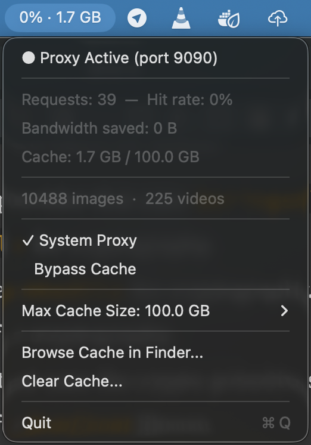
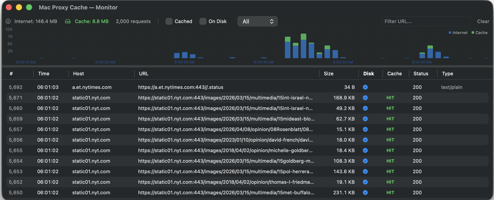

# Mac Proxy Cache




A macOS caching proxy server with a native menu bar app and a browsable media cache. Intercepts HTTP/HTTPS traffic via MITM, caches responses locally with proper file names and extensions, and serves them on subsequent requests. Browse your cached images and videos directly in Finder.

## Quick Start

```bash
# First-time setup (builds, generates CA, installs cert)
./scripts/setup.sh

# Start proxy + menu bar app (recommended)
./scripts/restart.sh

# Stop everything
./scripts/restart.sh --stop
```

After starting, the proxy auto-configures Safari and Chrome via macOS system proxy settings. A menu bar icon shows live hit rate and cache size.

## How It Works

The proxy sits between your browser and the internet. On first request, it forwards to the origin server and caches the response. On subsequent requests for the same URL, it serves from the local cache — typically in under 5ms.

Cached files are stored in a **browsable directory tree** at `~/mac-proxy-cache/cache/`:

```
~/mac-proxy-cache/cache/
  cdn.example.com/
    libs/lodash.js/4.17.21/lodash.min.js
  i.imgur.com/
    abc123.png
    def456.jpg
  www.redditstatic.com/
    shreddit/assets/favicon/192x192.png
  streaming-cdn.example.com/
    stream/
      master.m3u8
      720p/
        seg-00001.m4s
```

Open it in Finder — images show thumbnails, Quick Look works on everything. Responses are decompressed (gzip/deflate stripped) before storing so files are directly viewable.

## Monitor


The monitor window shows live request activity with a traffic chart, cache hit indicators, and filters. Double-click any cached entry to reveal it in Finder.

## Menu Bar App

The native macOS menu bar app shows live stats and provides quick controls:

- **Hit rate & cache size** in the menu bar (updates every second)
- **System Proxy toggle** — enable/disable macOS system proxy (Safari/Chrome)
- **Bypass Cache toggle** — forward all requests without serving from cache
- **Max Cache Size** — change on the fly (100MB to unlimited), persists across restarts
- **Browse Cache in Finder** — open the cache directory
- **Open Dashboard** — open the JSON API in browser

## CLI Usage

```bash
mac-proxy-cache start [--foreground] [--port 9090] [--no-system-proxy] [--max-cache-size 1G]
mac-proxy-cache stop
mac-proxy-cache status

mac-proxy-cache cache stats
mac-proxy-cache cache search <query>
mac-proxy-cache cache clear [--permanent]

mac-proxy-cache cert show
mac-proxy-cache cert install
mac-proxy-cache cert export <path>
```

## Dashboard API

When the proxy is running, a JSON API is available at `http://127.0.0.1:9091`:

| Endpoint                   | Method | Description                                                |
|----------------------------|--------|------------------------------------------------------------|
| `/api/health`              | GET    | Health check                                               |
| `/api/stats`               | GET    | Proxy + cache stats (hit rate, sizes, media counts)        |
| `/api/config`              | GET    | Current config (max sizes, bypass state)                   |
| `/api/config`              | POST   | Update config at runtime (`max_cache_size`, `max_entry_size`) |
| `/api/entries`             | GET    | List entries (`?host=`, `?media_type=`, `?status=`, `?q=`) |
| `/api/entries/:fp`         | DELETE | Mark stale or `?permanent=true` to delete                  |
| `/api/entries/:fp/restore` | POST   | Restore stale entry to active                              |
| `/api/cache/clear`         | POST   | Clear cache (`?permanent=true` for full wipe)              |
| `/api/bypass`              | POST   | Toggle bypass mode                                         |
| `/api/system-proxy`        | POST   | Enable/disable macOS system proxy (`{"enabled": true}`)    |
| `/api/cache/file/*path`    | GET    | Serve cached file directly (correct Content-Type)          |
| `/api/media`               | GET    | Media listing grouped by domain                            |

## Configuration

Config file: `~/.config/mac-proxy-cache/config.toml`

```toml
proxy_port = 9090
dashboard_port = 9091
data_dir = "~/mac-proxy-cache"
max_cache_size = 1073741824  # 1 GB
max_entry_size = 524288000   # 500 MB
stale_retention_days = 30
partial_range_ttl_days = 7
bypass_hosts = []
auto_system_proxy = true
serve_stale_on_error = false
```

Cache size can also be changed at runtime via the menu bar app or `POST /api/config`. Runtime changes are persisted in SQLite and survive restarts.

## Architecture

- **Rust proxy** (`hudsucker` + `tokio`) — MITM proxy with per-domain TLS cert generation via `rcgen`
- **SQLite** (`rusqlite` + WAL mode) — cache index with LRU tracking, settings persistence
- **axum** — dashboard API server (runs alongside proxy on separate port)
- **Swift/SwiftUI** — native macOS menu bar app (`MenuBarExtra`, macOS 13+)

### Cache Behavior

- **What gets cached:** JS, CSS, images, fonts, JSON, video segments, audio — all static assets
- **What doesn't get cached:** HTML pages (dynamic/SPA content), `Cache-Control: no-store` responses, responses larger than `max_entry_size`
- **Decompression:** gzip/deflate responses are decompressed before storing so files are viewable in Finder
- **Stale preservation:** invalidated files are renamed to `~stale~<timestamp>` instead of deleted, kept for `stale_retention_days`
- **Vary handling:** responses that `Vary` on `Origin` are not served from cache to prevent CORS issues

### Passthrough (not intercepted)

These connections are tunneled directly without MITM to avoid certificate pinning issues:

- Apple services (`.apple.com`, `.icloud.com`)
- WebSocket connections (`alive.*`, `*-realtime*`, `*-ws*`)
- IP-based connections (direct IP addresses)

### Range Requests & Video

- 206 Partial Content responses are stored as range slabs in `.parts/` directories
- Each slab is a file named `<start>-<end>.part` with a `_manifest.json` tracking coverage
- When all slabs are contiguous, they're assembled into a complete file
- HLS/DASH segments are cached as normal files (natural URL structure)
- YouTube URL normalization strips ephemeral tokens for stable cache keys

## Prerequisites

- **macOS 13+** (Ventura or later)
- **Rust** — install via [rustup](https://rustup.rs/): `curl --proto '=https' --tlsv1.2 -sSf https://sh.rustup.rs | sh`
- **Xcode Command Line Tools** — `xcode-select --install` (provides Swift compiler and system headers)
- **CMake** — required by `aws-lc-sys` (TLS crypto): `brew install cmake`

Verify your setup:

```bash
rustc --version    # 1.85+
swift --version    # 5.9+
cmake --version    # 3.x+
```

## Building

```bash
# Build everything
./scripts/build.sh

# Or build individually
cargo build              # Rust proxy + CLI (optimized dev profile)
cd app && swift build -c release  # Menu bar app
```

Note: The project uses `opt-level = 2` in the dev profile for near-release performance.

## Scripts

| Script | Purpose |
|---|---|
| `scripts/restart.sh` | Build, stop, start proxy + menu bar app with system proxy |
| `scripts/restart.sh --stop` | Stop everything and restore system proxy |
| `scripts/setup.sh` | First-time setup: build, generate CA, install cert |
| `scripts/dev.sh` | Start in foreground without system proxy (for development) |
| `scripts/start.sh` | Start with system proxy (Safari/Chrome auto-configured) |
| `scripts/start-menubar.sh` | Start via menu bar app only |
| `scripts/build.sh` | Build both Rust and Swift components |

## Data Directory

All runtime data is stored in `~/mac-proxy-cache/`:

| Path | Contents |
|---|---|
| `ca/ca.crt` | Root CA certificate (install in Keychain Access) |
| `ca/ca.key` | Root CA private key |
| `cache/` | Browsable cache tree organized by domain |
| `index.db` | SQLite database (cache index + settings) |
| `proxy.pid` | PID file for start/stop |
| `proxy-state.json` | Saved system proxy state for crash recovery |
| `proxy.log` | Log file (when running in background) |
